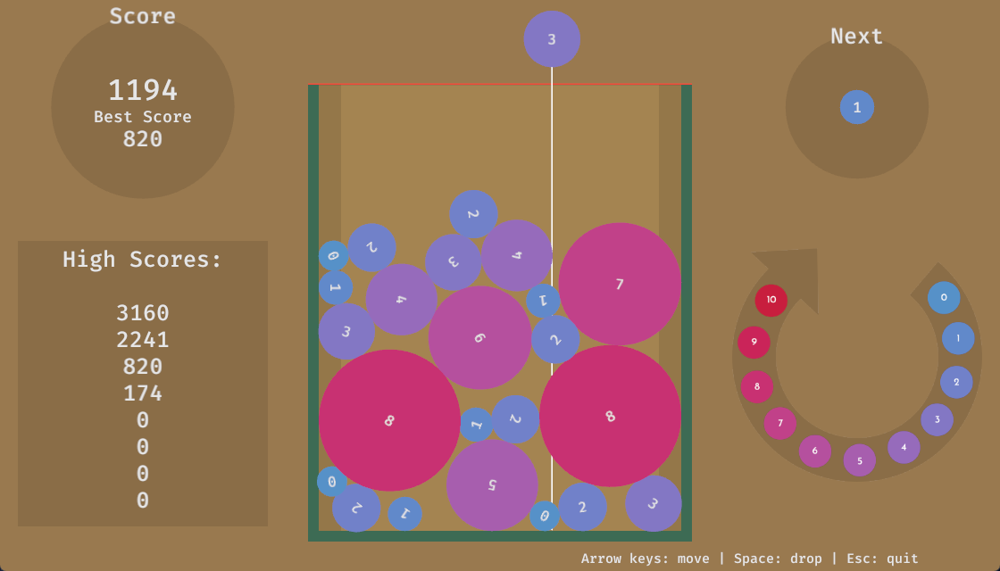

# Suika Game Clone

Inspired by IonXeph to create a suika clone in bevy, a game engine that I kinda gave up on.

Not a direct copy, but taking some ideas from his implementation.

IonXeph's suika spin off: https://github.com/ionxeph/suika

### To-do

- Add scoring
- Add more UI
- Fix cup rendering bug

### Setup

- rust/cargo v1.70.0
- bevy v0.11.3
- bevy_rapier2d v0.22.0
- rand v0.8.5

I make no guarantees on compatibility.

`cargo run` should just work for anybody with rust v1.70.x

`cargo build -r` to build an executable for your OS

### Acknowledgements

Please don't sue me Nintendo
